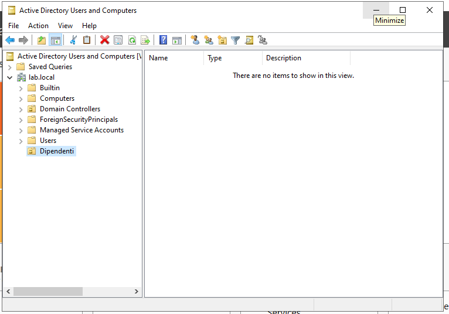
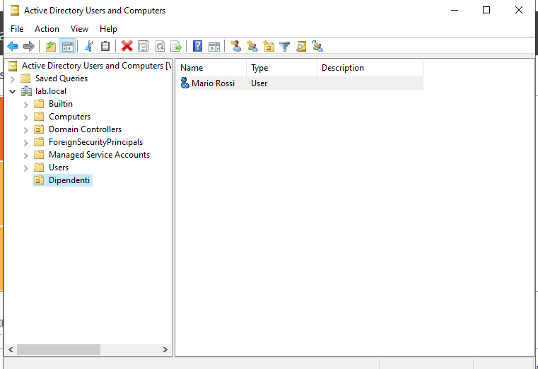
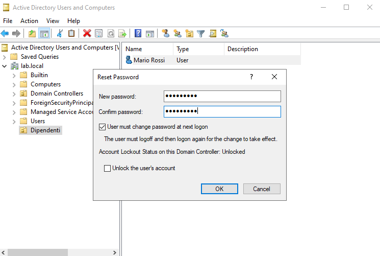
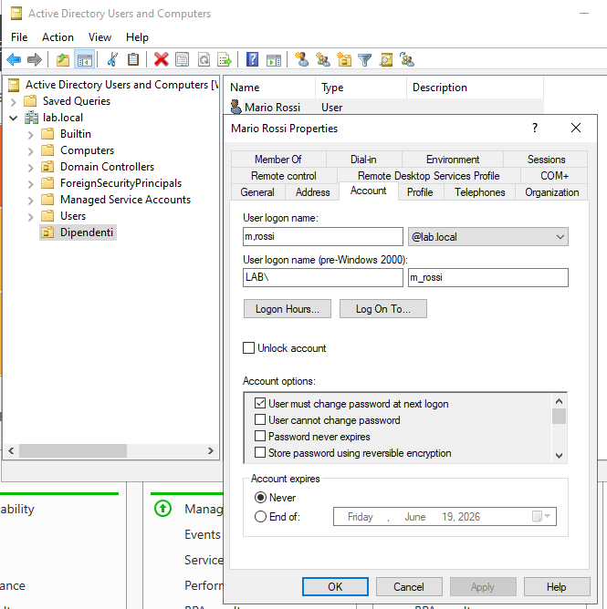
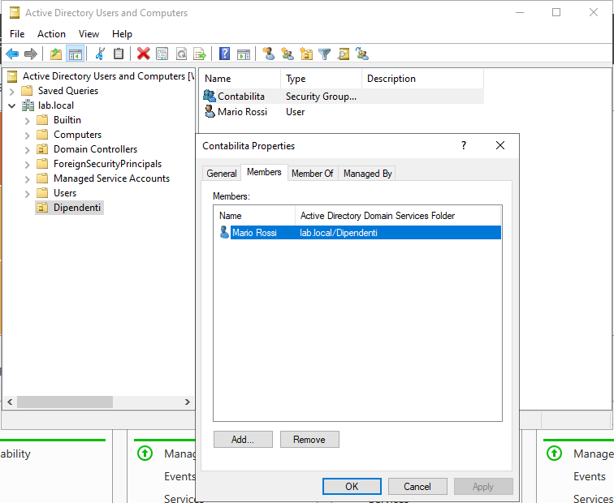

# Active Directory Lab

Lab pratico su Windows Server 2022 con Active Directory Domain Services (AD DS), realizzato su macchina virtuale VirtualBox a scopo di studio.

## Ambiente

- **Host:** Windows 11
- **Virtualizzazione:** Oracle VirtualBox
- **Guest:** Windows Server 2022 Standard Evaluation (Desktop Experience)
- **Dominio:** lab.local

## Operazioni eseguite

### 1. Creazione Organizational Unit (OU)

Creata la OU "Dipendenti" all'interno del dominio lab.local per organizzare gli utenti per reparto, simulando una struttura aziendale reale.

### 2. Creazione utente

Creato l'utente Mario Rossi (m.rossi@lab.local) nella OU Dipendenti con obbligo di cambio password al primo accesso.

### 3. Reset password

Eseguito il reset della password dell'utente simulando una richiesta help desk. Impostata password temporanea con obbligo di cambio al login successivo.

### 4. Gestione blocco account

Esaminato il tab Account delle proprietà utente, dove si gestisce lo sblocco degli account bloccati per troppi tentativi di accesso falliti.

### 5. Creazione gruppo e aggiunta utente

Creato il gruppo di sicurezza "Contabilita" (Global Security Group) e aggiunto Mario Rossi come membro.

## Competenze dimostrate

- Installazione e configurazione di Windows Server 2022
- Promozione del server a Domain Controller
- Gestione di Organizational Units (OU)
- Creazione e gestione utenti in Active Directory
- Reset password e sblocco account
- Creazione gruppi di sicurezza e gestione membri
