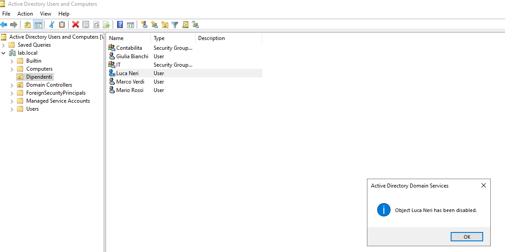
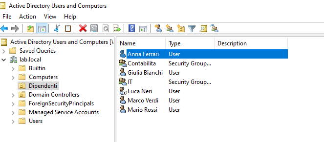
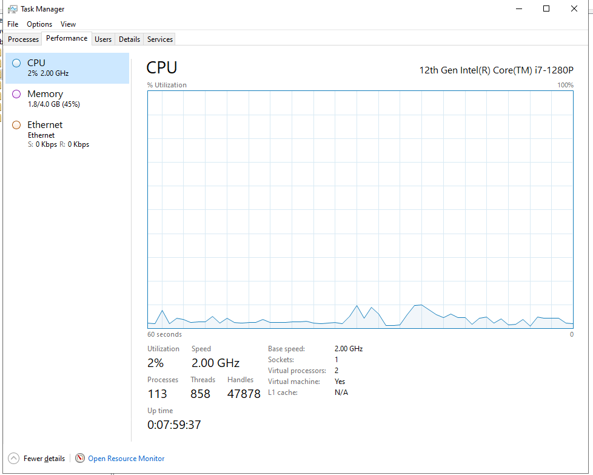
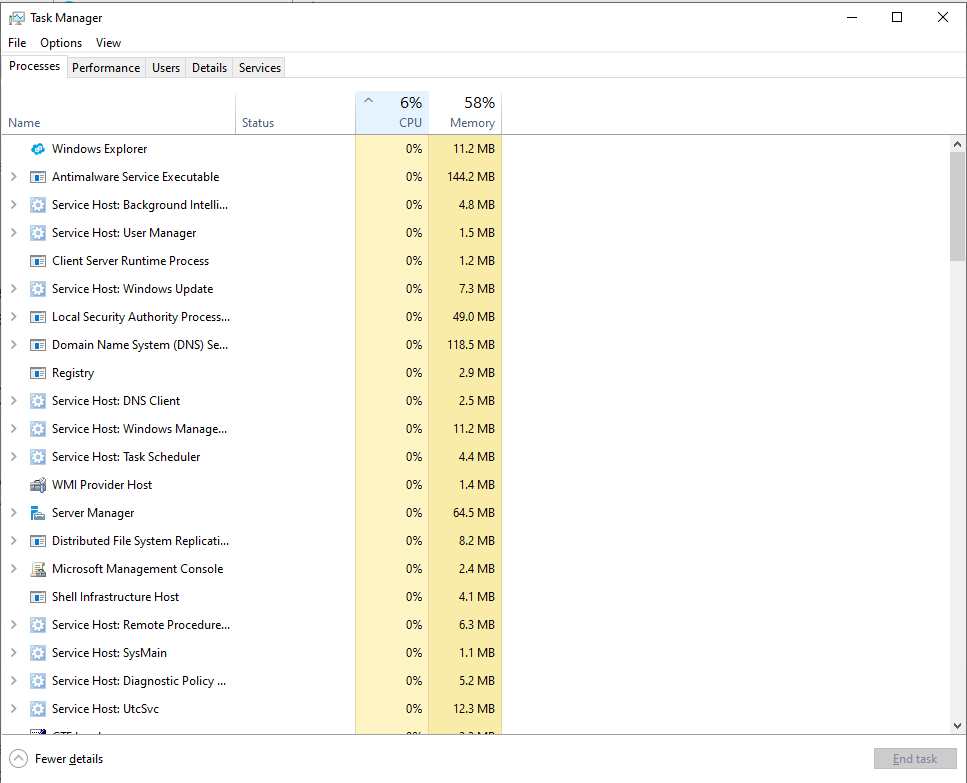
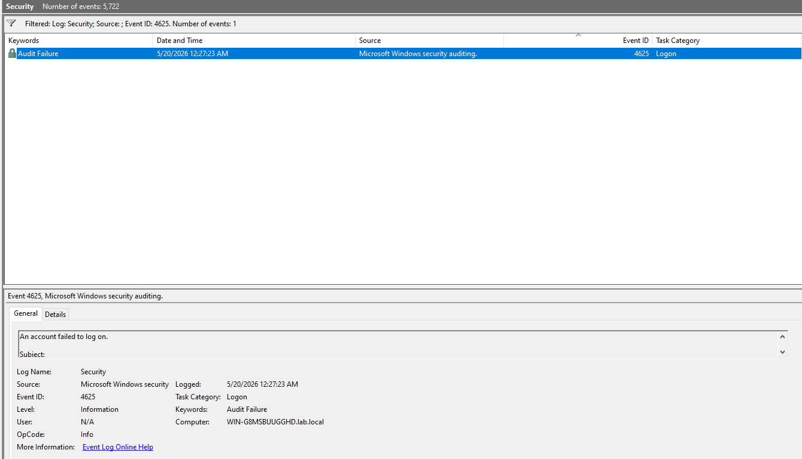
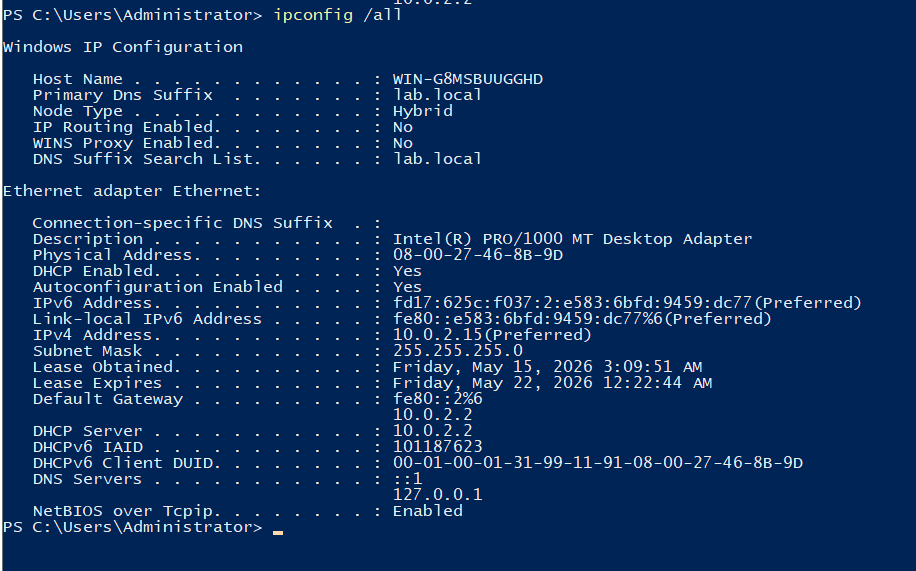
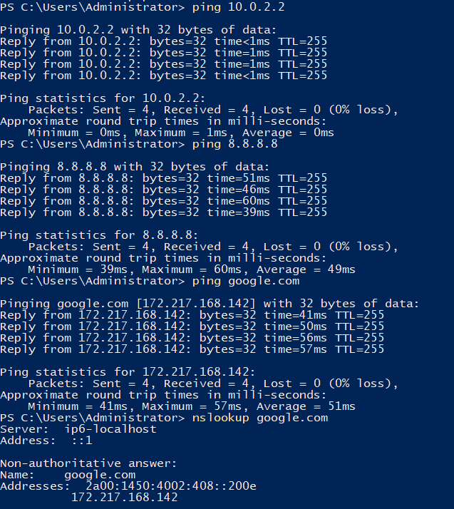

# Active Directory Lab

Lab pratico su Windows Server 2022 con Active Directory Domain Services (AD DS), realizzato su macchina virtuale VirtualBox a scopo di studio.

## Ambiente

- **Host:** Windows 11
- **Virtualizzazione:** Oracle VirtualBox
- **Guest:** Windows Server 2022 Standard Evaluation (Desktop Experience)
- **Dominio:** lab.local

## Operazioni eseguite

### 1. Creazione Organizational Unit (OU)

Creata la OU "Dipendenti" all'interno del dominio lab.local per organizzare gli utenti per reparto, simulando una struttura aziendale reale.

### 2. Creazione utente

Creato l'utente Mario Rossi (m.rossi@lab.local) nella OU Dipendenti con obbligo di cambio password al primo accesso.

### 3. Reset password

Eseguito il reset della password dell'utente simulando una richiesta help desk. Impostata password temporanea con obbligo di cambio al login successivo.

### 4. Gestione blocco account

Esaminato il tab Account delle proprietà utente, dove si gestisce lo sblocco degli account bloccati per troppi tentativi di accesso falliti.

### 5. Creazione gruppo e aggiunta utente

Creato il gruppo di sicurezza "Contabilita" (Global Security Group) e aggiunto Mario Rossi come membro.

### 6. Disabilitazione account

Simulato l'offboarding di un dipendente: account disabilitato immediatamente su richiesta HR. L'icona con la freccia verso il basso indica visivamente l'account disabilitato in ADUC.

### 7. Scenari pratici help desk

Simulati scenari reali di supporto:

- Nuovo assunto: creazione utente Giulia Bianchi, assegnazione al gruppo IT
- Account bloccato: sblocco account e reset password per Marco Verdi
- Password dimenticata: reset completo per Anna Ferrari con obbligo di cambio al primo accesso

### 8. Troubleshooting con Task Manager

Utilizzo del Task Manager per identificare processi che consumano CPU e RAM eccessiva. Tab Performance per monitoraggio in tempo reale, tab Processes per identificare il processo problematico.

### 9. Analisi log con Event Viewer

Utilizzo dell'Event Viewer per analizzare il log Security. Filtrato per Event ID 4625 (login falliti) per identificare tentativi di accesso non autorizzati.

| Event ID | Significato      |
| -------- | ---------------- |
| 4624     | Login riuscito   |
| 4625     | Login fallito    |
| 4634     | Logoff           |
| 4740     | Account bloccato |

### 10. Troubleshooting di rete

Utilizzo dei comandi di rete per diagnosticare problemi di connettività seguendo un approccio a strati:

- `ipconfig /all` — verifica configurazione IP, DHCP e DNS
- `ping gateway` — verifica rete locale
- `ping 8.8.8.8` — verifica connettività internet
- `ping google.com` — verifica risoluzione DNS
- `nslookup` — diagnostica specifica del DNS

## Competenze dimostrate

- Installazione e configurazione di Windows Server 2022
- Promozione del server a Domain Controller
- Gestione di Organizational Units (OU)
- Creazione e gestione utenti in Active Directory
- Reset password e sblocco account
- Disabilitazione account per offboarding
- Creazione gruppi di sicurezza e gestione membri
- Gestione scenari reali di supporto help desk
- Monitoraggio processi e performance con Task Manager
- Analisi log di sicurezza con Event Viewer
- Troubleshooting di rete con ipconfig, ping e nslookup
